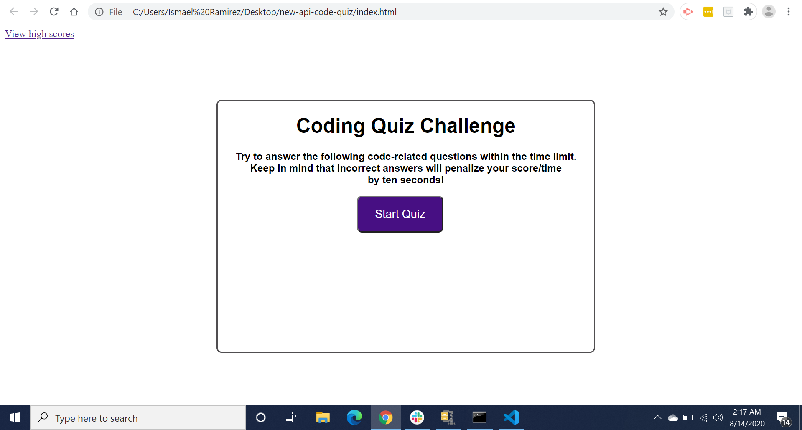
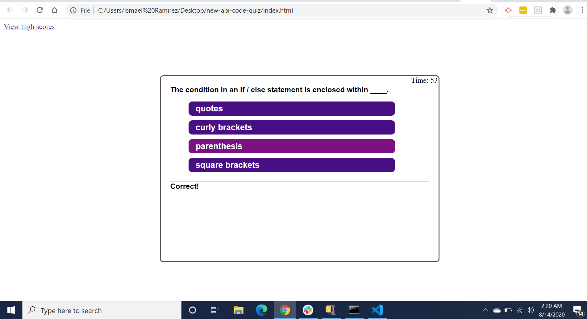

This is a timed quiz on JavaScript fundamentals that stores high scores.
When you take this quiz you'll press the start button... a timer will then 
start at the same time presenting you with the first question. When you 
answer the first question you are then presented with another question.
But when answering a question incorrectly, time will be subtracted from 
the timer. If all the questions are answered or the timer reaches its end,
then the quiz is over, when the quiz is over your initials and score could
be saved. Application user interface is clean and easy to navigate.

Format: 

Format: 
